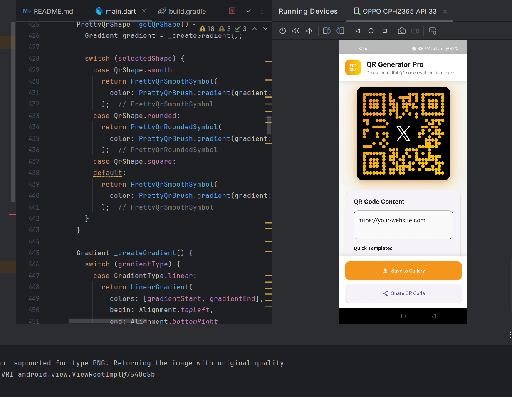
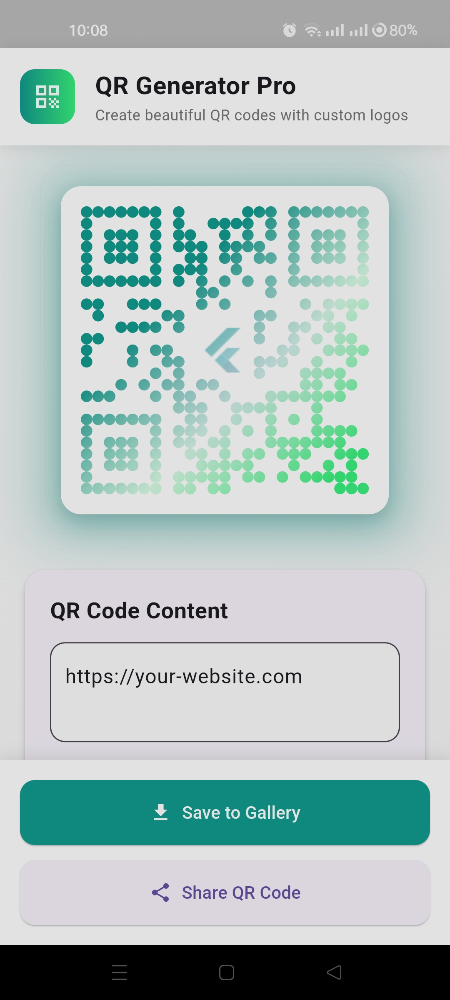
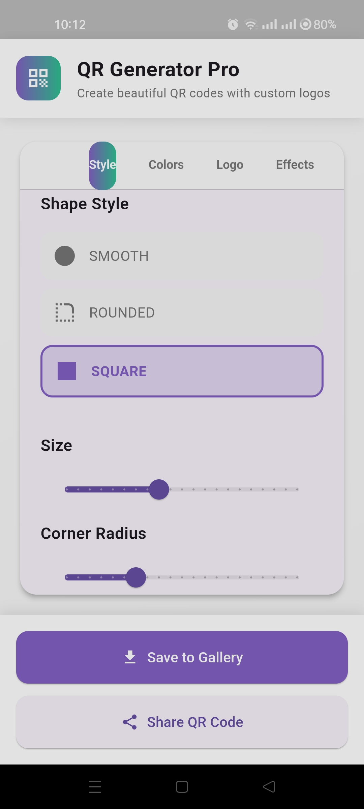
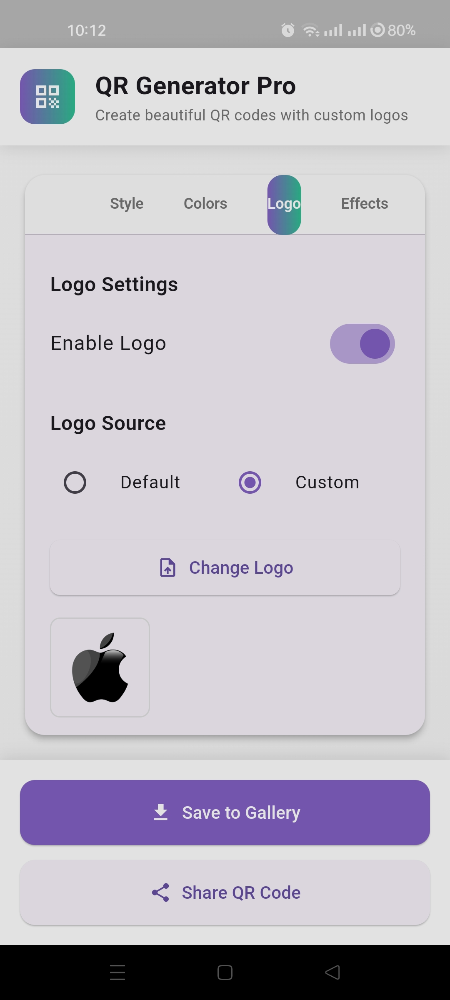
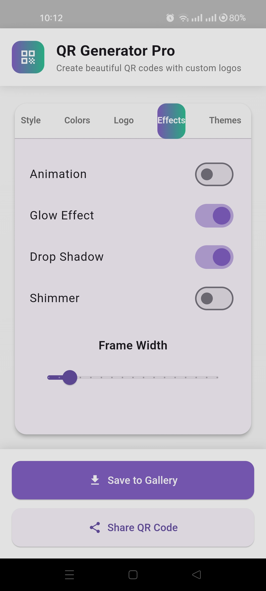
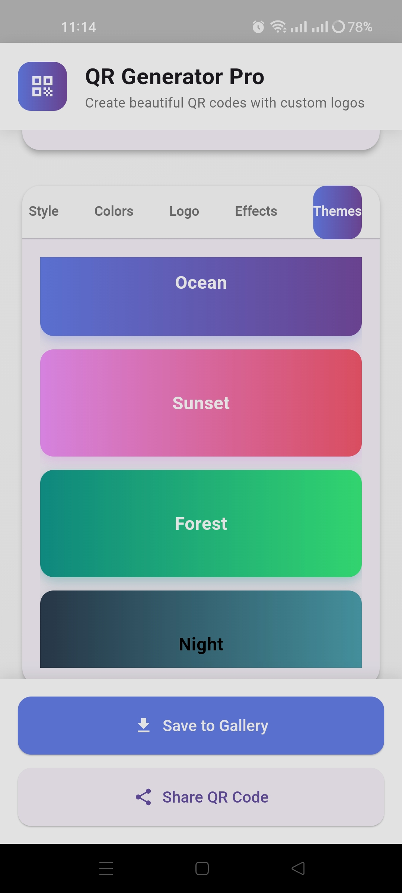

# 🎨 Flutter Colorful QR Code Generator

[](https://flutter.dev)
[](https://dart.dev)
[](https://opensource.org/)
[](LICENSE)

---

## 🧠 Overview

**Flutter Colorful QR Code Generator** is a **modern, Flutter and Dart-based application** that enables users to create **unique and vibrant QR codes**. The app goes beyond standard QR generation by offering **customization options** for colors, patterns, and styles — perfect for **personal branding, marketing materials, and creative projects**.

This project demonstrates how to integrate **dynamic design with functional QR code generation**, combining aesthetic appeal with practical use.

---

## 🎬 Intro

<div align="center">
  
  []
    
</div>


## ✨ Features

* 🎨 **Customizable QR Codes** — Choose from multiple color combinations and styles.
* ⚡ **Instant Generation** — Generate beautiful QR codes in seconds.
* 📱 **Cross-Platform** — Works seamlessly on Android, iOS, Web, and Desktop.
* 💾 **Save & Share** — Easily download and share your generated QR codes.
* 🧩 **Built with pretty_qr_code** — Leverages the power of the Flutter package for stylish and optimized output.

---

## 📸 Screenshots

<div align="left">
  <table>
    <tr>
      <td></td>
      <td></td>
      <td></td>
      <td></td>
    </tr>
  </table>
</div>

<div align="left">
  <table>
    <tr>
      <td></td>
      <td></td>
      <td></td>
      <td></td>

  </table>
</div>

<div align="left">
  <table>
    <tr>
      <td></td>
      <td></td>
      <td></td>
      <td></td>

  </table>
</div>

---

## 🎥 Demo Video

Watch the Flutter Colorful QR Code Generator in action on **X :**
👉 [Watch the Demo Here](https://x.com/KishanP07684084/status/1947298006396449177)

---

## 🏗️ Tech Stack

| Technology          | Description                                           |
| ------------------- | ----------------------------------------------------- |
| **Flutter**         | Cross-platform UI toolkit for natively compiled apps  |
| **Dart**            | Programming language used for app logic and UI design |
| **pretty_qr_code**  | Package for customizable QR code generation           |
| **Material Design** | Ensures consistent, elegant UI/UX                     |

---

## ⚙️ Installation & Setup

Follow the steps below to set up and run the project locally:

### 1️⃣ Clone the Repository

```bash
git clone https://github.com/<your-username>/flutter-colorful-qr-generator.git
cd flutter-colorful-qr-generator
```

### 2️⃣ Install Dependencies

```bash
flutter pub get
```

### 3️⃣ Run the App

```bash
flutter run
```

---

## 💡 Use Cases

* 🪪 **Personal Branding** — Design QR codes that match your personal or business identity.
* 📣 **Marketing Campaigns** — Make QR codes that stand out on posters, flyers, or packaging.
* 🎉 **Creative Projects** — Add a touch of design to your digital art or portfolio.

---

## 🤝 Contributing

Contributions are always welcome! To get started:

1. Fork the repository
2. Create a new branch (`git checkout -b feature/your-feature`)
3. Commit your changes (`git commit -m 'Add a new feature'`)
4. Push to the branch (`git push origin feature/your-feature`)
5. Open a Pull Request

---

## 🪪 License

This project is licensed under the **MIT License** — see the [LICENSE](LICENSE) file for details.

---

## 💬 Connect

For questions, feedback, or collaborations:

📧 **[My Email](coolmax17787@gmail.com)**
🐦 **[Follow me on X (Twitter)](https://x.com/KishanP07684084)**
💼 **[LinkedIn](https://www.linkedin.com/in/hom-bdr-pathak-01a3bb210)**

---

> 🌟 *If you find this project helpful or inspiring, don't forget to star the repo and share it with your network!*
